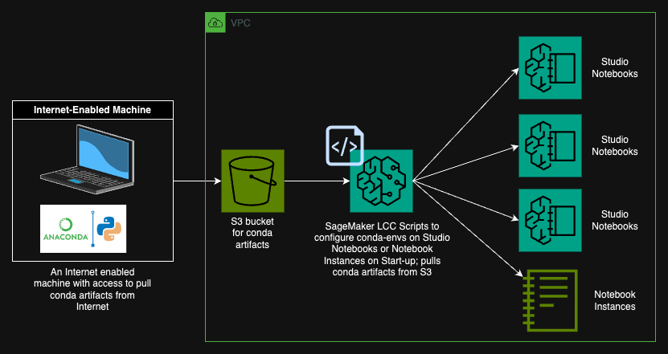

# Offline Anaconda Python Installation on SageMaker Studio or Notebook Instances

In this section of the repository we cover how to install a custom version of python3x on SageMaker Studio or SageMaker Notebook Instances with no internet access on Studio JupyterLab or Code Editor or Notebook Instances.

For this to be successful we require the following,
1. Any machine with access to internet (this machine does not have to be on the same VPC or network as the SageMaker Interactive Instances - we just need a single machine to download artifacts from the internet to store as a source to then install on the Interactive "air-gapped" Studio or Notebook Instances)
2. Access to S3



## Step 1: Download custom python3 and additional module artifacts and save files to S3

The steps below will typically be run **once** on a machine with internet access to create a source of tarballs/packages which will then be leveraged by "air-gapped" Studio Notebook instances or Notebook Instances to create similar custom python environments offline.

### 1.1
On a machine with internet access, set a custom path to install python3 using anaconda. If you dont have anaconda installed on this local internet enabled machine please follow instruction [here](https://docs.anaconda.com/free/anaconda/install/).

```bash
export LOCAL_PYTHON_PREFIX="<custom/path/to/python3>"
conda create --prefix $LOCAL_PYTHON_PREFIX/python39 python=3.9
conda activate $LOCAL_PYTHON_PREFIX/python39
```

### 1.2
With the new environment activated, install any packages you wish to make available on "air-gapped" SageMaker Studio or Notebook Instances.

```bash
conda install pandas seaborn plotly ipykernel
```

### 1.3
Run the command below to export a list of packages and the tarball source paths to a list,

```bash
conda list --explicit > ./spec-file.txt
```
### 1.4
Write a simple script to download all tarballs from the `spec-file.txt` automatically and save them locally. These tarballs are going to be made available on the machine with no internet access ("air-gapped") to replicate this python-env,
```bash
echo '#!/bin/bash
input_file="spec-file.txt"
target_dir="./conda_pkgs"

mkdir -p "$target_dir"

grep -Eo "https://[^ ]+" "$input_file" | while read -r url; do
    wget --no-check-certificate -P "$target_dir" "$url"
done' > download_conda_artifacts.sh
```

Make the `download_conda_artifacts.sh` an executable script and run the script,

```bash
chmod +x download_conda_artifacts.sh
sh download_conda_artifacts.sh
```
 ### 1.4.1 (optional)

To validate if the python environment packages have indeed been downloaded to the local machine - simply run `ls -l ./conda_pkgs`.

### 1.5
Now, push all tarballs to S3. This S3 bucket with prefix will act as a source for your Studio Notebook instances or Notebook Instances and will be used to replicate your python environments,

```bash
# change bucket and/or prefix 
aws s3 cp --recursive ./conda_pkgs s3://sagemaker-us-east-1-1234567890/conda-artifacts/conda-pkgs/
```

## Step 2: Run or Create LCC

Using s3 as a package/tarball source, running the script below on the "air-gapped" machine will 
1. Download packages from s3 to local instance
2. Create a conda environment on the local machine in `--offline` mode

Alternatively (recommended) create a Studio Lifecycle Configuration or Notebook Instance Lifecycle Configuration to simplify the process of environment creation. This can be setup by a SageMaker admin so users have these environment already created on their "air-gapped" instances.

> :warning: Use this path if you're using Notebook instances `/home/ec2-user/anaconda3/envs/` else `/home/sagemaker-user/.conda/envs/` if you're on Studio JupyterLab or CodeEditor.

Use [this script](./install_conda_python_offline.sh) to automate the creation of conda-environment on the "air-gapped" machine (please edit the variables appropriately before running the script.)

```bash
#!/bin/bash

export LOCAL_PYTHON_ENV_PATH="/home/ec2-user/anaconda3/envs/py39"
export LOCAL_CONDA_PKG_CACHE="/home/ec2-user/conda_pkgs/"
mkdir -p $LOCAL_CONDA_PKG_CACHE
echo "Downloading packages locally..."
aws s3 cp s3://sagemaker-us-east-1-1234567890/conda-artifacts/conda-pkgs/ $LOCAL_CONDA_PKG_CACHE --recursive

echo "Creating local python39 env..."
/home/ec2-user/anaconda3/condabin/conda create --prefix $LOCAL_PYTHON_ENV_PATH --use-local $LOCAL_CONDA_PKG_CACHE* --offline

echo "Installing local py39 as a kernel!"
$LOCAL_PYTHON_ENV_PATH/bin/python3 -m ipykernel install --prefix $LOCAL_PYTHON_ENV_PATH --display-name "user-env:py39"
```
